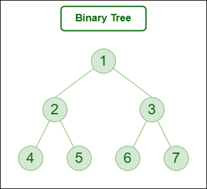

# DATA STRUCTURES


#### 1. Arrays

```c++
dt array_name[length]; //static array
dt* array_name = new dt[length]; //dynamic array

//Matrix
dt matrix_name[rows][cols];
dt* matrix_name = new dt* [rows]
for (int i=0;i<rows;i++)
{
    matrix_name[i] = new dt* [cols]
}
```

#### 2. [Strings (GFG)](https://www.geeksforgeeks.org/strings-in-cpp/)

#### 3. Linked-List

-   ```cpp
      class Node {
      public:
          int data;
          Node* next;

          Node(int val) : data(val), next(NULL) {}

          ~Node() {
              if (next != NULL) {
                  delete next; // Recursively delete the next node
                  next = NULL;
              }
          }
      };
    ```

-   **Types**
    -   Single-Linked List
    -   Doubly-Linked List
    -   Circular-Linked List

#### 4. Trees

-   ```cpp
      class TreeNode {
      public:
          int data;
          vector<TreeNode*> children;
          TreeNode(int val) : data(val) {}
          ~TreeNode() {
              for (TreeNode* child : children) {
                  delete child;
              }
          }
      };
    ```
-   **Types**
    -   Binary Tree
        -   At most 2 children
        -   
    -   Binary Search Tree
        -   All the nodes in the left subtree of a node are less than the node.
        -   All the nodes in the right subtree of a node are greater than the node.
        -   
    -   Self Balancing Trees
        -   AVL Tree
            -   Difference between heights of left and right subtrees for any node cannot be more than one.
            -   
        -   Red-Black Tree
            -   Each node has an extra bit, and that bit is often interpreted as the color (red or black), which ensure that the tree remains balanced during insertions and deletions.
            -   The root of the tree is always black.
            -   Every node has a color either red or black.
            -   There are no two adjacent red nodes (A red node cannot have a red parent or red child).
            -   All leaf (NULL) nodes are black nodes.
            -   

#### 5. Heaps

-   It is a complete binary tree with heap order property
-   A **min** heap is structured with the root node as the smallest and each child subsequently larger than its parent
-   A **max** heap is structured with the root node as the largest and each child subsequently smaller than its parent
-   **MinHeap Implementation**

```c++
class Heap{
    vector<int> arr;
    Heap(){}
    ParentIndex(int index) {
        return (index - 1) / 2;
    }
    LeftChildIndex(int index) {
        return 2 * index + 1;
    }
    RightChildIndex(int index) {
        return 2 * index + 2;
    }
    insert(val){
        arr.push_back(val);
        // maintain the heap order property and move the inserted element to its correct position
        i = arr.size()-1;
        while(i>0){
            pi = ParentIndex(i);
            if(arr[i]<arr[pi])
            {
                swap(arr[i],arr[pi])
                i = pi;
            }
        }
    }
    delete(){
        // swap root node with the last node and remove the new last node
        int min = heapArray[0];
        heapArray[0] = heapArray.back();
        heapArray. pop_back();
        i = 0
        while(i<arr.size()){
            li = 2*i+1
            ri = 2*i+2
            si = i
            if(li<arr.size()&&arr[li]<arr[i]){
                si = li;
            }
            if(ri<arr.size()&&arr[ri]<arr[i]){
                si = ri;
            }
            if(si!=i){
                swap(arr[i],arr[si]);
                i = si;
            }
            else{
                break;
            }
        }
        return min;
    }
};
```

Heapify

```c++
// To create a min-heap or max-heap from an unsorted array: call heapify function on first n/2 nodes
void heapify(arr, n,i){
    s = i;
    li = 2*i+1
    ri = 2*i+2
    if(li<n&&arr[s]>arr[li]){
        s = li;
    }
    if(ri<n&&arr[s]>arr[ri]){
        s = ri;
    }
    if(s != i){
        swap(arr[i],arr[s])
        heapify(arr,n,s)
    }
}
```

#### 6. Trie

-   If two strings have a common prefix then they will have the same ancestor in the trie.
-   [GFG](https://www.geeksforgeeks.org/trie-insert-and-search/)

#### 7. Graphs

-   **Representation**
    -   Adjacency Matrix: The graph is represented by a 2D matrix where rows and columns denote vertices. Each entry in the matrix represents the weight of the edge between those vertices
    -   Adjacency List: This graph is represented as a collection of linked lists. There is an array of pointer which points to the edges connected to that vertex.
-   **Types**
    1. Undirected Graph: A graph in which edges do not have any direction.
    2. Directed Graph: A graph in which edge has direction.
    3. Connected Graph: The graph in which from one node we can visit any other node in the graph.
    4. Disconnected Graph: The graph in which at least one node is not reachable from a node.
    5. Complete Graph: The graph in which from each node there is an edge to each other node.
    6. Cyclic Graph: A graph containing at least one cycle is known as a Cyclic graph.
    7. Acyclic Graph: A Graph that does not contain any cycle.
    8. Weighted Graph: A graph in which the edges are already specified with suitable weight.

#### 8. [Disjoint Set (GFG)](https://www.geeksforgeeks.org/introduction-to-disjoint-set-data-structure-or-union-find-algorithm/)

##### 9. STL

-   **Pair**
-   **[Vectors (GFG)](https://www.geeksforgeeks.org/vector-in-cpp-stl/)**
-   **[Lists (GFG)](https://www.geeksforgeeks.org/list-cpp-stl/)**
-   **[Stack (GFG)](https://www.geeksforgeeks.org/stack-in-cpp-stl/)**
-   **Queues**
    -   Queue
        -   Fist In First Out
        -   ```c++
              queue<int> q;
              q.push(val);
              q.back();
              q.front();
              q.pop();
            ```
    -   Deque
        -   Doubly ended queue
        -   ```c++
              deque<int> dq;
              dq.push_back(value);
              dq.push_front(value);
              dq.pop_back();
              dq.pop_front();
              dq.front();
              dq.back();
            ```
    -   Priority Queue
        -   ```c++
              priority_queue<int> pq; // max-heap priority queue (topmost element is the greatest element)
              priority_queue<int,vector<int>,greater<int>> pq; // min-heap priority queue (topmost element is the smallest element)
              pq.push(val);
              pq.top();
            ```
-   **[Set (GFG)](https://www.geeksforgeeks.org/set-in-cpp-stl/)**
-   **[Map (GFG)](https://www.geeksforgeeks.org/map-associative-containers-the-c-standard-template-library-stl/)**
