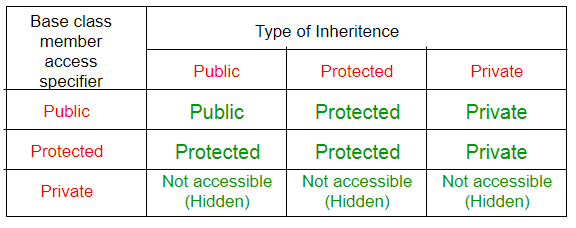

# OOPS

#### 1. Class

-   [GFG](https://www.geeksforgeeks.org/c-classes-and-objects/)
-   difference between a structure and a class: structure members have public access by default and class members have private access by default

#### 2.[Encapsulation (GFG)](https://www.geeksforgeeks.org/encapsulation-in-cpp/?ref=lbp)

#### 3. [Abstraction (GFG)](https://www.geeksforgeeks.org/abstraction-in-cpp/?ref=lbp)

#### 4. Inheritence

-   derive properties and characteristics from another class is called Inheritance.
-   **Sub Class**: class that inherits properties from another class
-   **Super Class**: class whose properties are inherited by a subclass
-   Derived class syntax: `class  <derived_class_name> : <access-specifier> <base_class_name>`
-   Whether derived class's default constructor is called or parameterised is called, base class's default constructor is always called inside them.
-   To call base class's parameterised constructor inside derived class's parameterised constructor, we must mention it explicitly while declaring derived class's parameterised constructor.
-   
-   Ambiguity
    -   if there is inheritence ambiguity or confusion then scope resolution operator can be used to resolve it
    -   Virtual Base class can also be used to overcome this problem
-   Types:
    -   **Single Inheritence**: 
    -   **Multilevel Inheritence**: 
    -   **Multiple Inheritence**: 
    -   **Hierarchial Inheritence**: 
    -   **Hybrid Inheritence**: 

#### 5. [Polymorphism (GFG)](https://www.geeksforgeeks.org/cpp-polymorphism/)

#### 6. [Static (GFG)](https://www.geeksforgeeks.org/static-member-function-in-cpp/)

#### 7. [Templates (GFG)](https://www.geeksforgeeks.org/templates-cpp/)

#### 8. Const

-   The `const` keyword is used to declare constants, define read-only variables, and specify that a member function does not modify the object's state
-   **Constant Variables**: declare variables as constants using `const` keyword. Once initialized, the value of these variables cannot be changed.
-   **Constant Pointer**: declare a constant pointer or a pointer that points to a constant value or both.

```cpp
const int* ptr1; // Pointer to constant integer
int* const ptr2; // Constant pointer to integer
const int* const ptr3; // Constant pointer to constant integer
```

-   **Const Member Functions**: member function does not modify the state of the object
-   ```cpp
    class MyClass
    {
    public:
        void print() const {}
    };
    ```
-   **Const References**: declare references as constant, the referenced value cannot be modified through that reference. `const int& ref = 42;`
