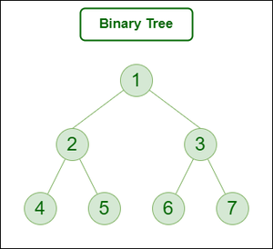

# DATA STRUCTURES


### Arrays

-   0-based indexing
-   Passing arrays to function: when arrays are passed array address is copied in the formal parameters and the elements are accessed by their address
-   1-D arrays
    -   `return_type array_name[length]` Static array declaration
    -   `return_type * array_name = new return_type[length]` dynamic array declaration
-   2-D arrays
    -   `return_type matrix_name[rows][cols]` Static matrix declaration
    -   dynamic matrix declaration
    -   ```c++
            return_type * matrix_name = new return_type* [rows]
            for(int i=0;i<rows;i++){
                matrix_name[i] = new return_type* [cols]
            }
        ```

### Strings

-   similar to 1-D Character arrays
-   '\0'(Null character) is inserted automatically at the end of the string as a terminator

### Linked-List

-   ```cpp
      class ListNode {
      public:
          int data;
          ListNode* next;

          ListNode(int val) : data(val), next(nullptr) {}

          ~ListNode() {
              if (next != nullptr) {
                  delete next; // Recursively delete the next node
                  next = nullptr;
              }
          }
      };
    ```

-   **Types**
    -   Single-Linked List: Traversing a singly linked list is done in a forward direction
    -   Doubly-Linked List: Traversal in both forward and backward directions, but it requires additional memory for the backward reference
    -   Circular-Linked List: The last node points back to the head node, creating a circular structure. It can be either singly or doubly linked.

### Trees

-   ```cpp
      class TreeNode {
      public:
          int data;
          vector<TreeNode*> children;
          TreeNode(int val) : data(val) {}
          ~TreeNode() {
              for (TreeNode* child : children) {
                  delete child; // Recursively delete children
              }
          }
      };
    ```
-   **Types**
    -   Binary Tree
        -   At most 2 children
        -   
    -   Binary Search Tree
        -   The left subtree of a node contains only nodes lesser than the node.
        -   The right subtree of a node contains only nodes greater than the node.
        -   The left and right subtree each must also be a binary search tree.
        -   
    -   Segment Tree
        -   
    -   Self Balancing Trees
        -   AVL Tree
            -   Difference between heights of left and right subtrees for any node cannot be more than one.
            -   
        -   Red-Black Tree
            -   Each node has an extra bit, and that bit is often interpreted as the color (red or black), which ensure that the tree remains balanced during insertions and deletions.
            -   The root of the tree is always black.
            -   Every node has a color either red or black.
            -   There are no two adjacent red nodes (A red node cannot have a red parent or red child).
            -   All leaf (NULL) nodes are black nodes.
            -   

### Heaps

-   It is a complete binary tree with heap order property
-   A **min** heap is structured with the root node as the smallest and each child subsequently larger than its parent
-   A **max** heap is structured with the root node as the largest and each child subsequently smaller than its parent
-   **MinHeap Implementation**

    -   ```c++
        class Heap{
            vector<int> arr;
            Heap(){}
            ParentIndex(int index) {
                return (index - 1) / 2;
            }
            LeftChildIndex(int index) {
                return 2 * index + 1;
            }
            getRightChildIndex(int index) {
                return 2 * index + 2;
            }
            insert(val){
                // first insert element at the end of the array i.e, at the last node of the heap or tree
                arr.push_back(val);
                // maintain the heap order property and move the inserted element to its correct position
                i = arr.size()-1;
                while(i>0){
                    pi = ParentIndex(i);
                    if(arr[i]<arr[pi])
                    {
                        swap(arr[i],arr[pi])
                        i = pi;
                    }
                }
            }
            delete(){
                // swap root node with the last node and remove the new last node
                int min = heapArray[0];
                heapArray[0] = heapArray.back();
                heapArray. pop_back();
                // maintain heap order property
                i = 0
                while(i<arr.size()){
                    li = 2*i+1
                    ri = 2*i+2
                    si = i
                    if(li<arr.size()&&arr[li]<arr[i]){
                        si = li;
                    }
                    if(ri<arr.size()&&arr[ri]<arr[i]){
                        si = ri;
                    }
                    if(si!=i){
                        swap(arr[i],arr[si]);
                        i = si;
                    }
                    else{
                        break;
                    }
                }
                return min;
            }
        };
        // To create a min-heap or max-heap from an unsorted array
        // call heapify function on first n/2 nodes
        void heapify(arr, n,i){
            s = i;
            li = 2*i+1
            ri = 2*i+2
            if(li<n&&arr[s]>arr[li]){
                s = li;
            }
            if(ri<n&&arr[s]>arr[ri]){
                s = ri;
            }
            if(s != i){
                swap(arr[i],arr[s])
                heapify(arr,n,s)
            }
        }
        ```

### Trie

-   Trie follows some property that If two strings have a common prefix then they will have the same ancestor in the trie.
-   ```c++
      const int ALPHABET_SIZE = 26;

      class Trie {
      private:
          Trie* children[ALPHABET_SIZE];
          bool isEndOfWord;
      public:
          Trie() {
              isEndOfWord = false;
              for (int i = 0; i < ALPHABET_SIZE; ++i) {
                  children[i] = nullptr;
              }
          }
          // Insert a word into the trie
          void insert(string word) {
              Trie* current = this;
              for (char c : word) {
                  int index = c - 'a';
                  if (current->children[index] == nullptr) {
                      current->children[index] = new Trie();
                  }
                  current = current->children[index];
              }
              current->isEndOfWord = true;
          }
          // Search for a word in the trie
          bool search(string word) {
              Trie* current = this;
              for (char c : word) {
                  int index = c - 'a';
                  if (current->children[index] == nullptr) {
                      return false; // Not found
                  }
                  current = current->children[index];
              }
              return current != nullptr && current->isEndOfWord; // Check if it's the end of a word
          }
          // Delete a word from the trie
          bool remove(string word) {
              return removeHelper(this, word, 0);
          }
      private:
          bool removeHelper(Trie* current, string word, int index) {
              if (current == nullptr) return false;

              if (index == word.length()) {
                  if (!current->isEndOfWord) {
                      return false; // Word not found
                  }
                  current->isEndOfWord = false;
                  // Check if current node has no children and can be deleted
                  for (int i = 0; i < ALPHABET_SIZE; ++i) {
                      if (current->children[i] != nullptr) {
                          return false;
                      }
                  }
                  delete current;
                  return true;
              }
              int idx = word[index] - 'a';
              bool shouldDeleteCurrentNode = removeHelper(current->children[idx], word, index + 1);
              // If true is returned, delete the TrieNode pointer
              if (shouldDeleteCurrentNode) {
                  current->children[idx] = nullptr;
                  // Check if current node has no children and can be deleted
                  for (int i = 0; i < ALPHABET_SIZE; ++i) {
                      if (current->children[i] != nullptr) {
                          return false;
                      }
                  }
                  delete current;
                  return true;
              }
              return false;
          }
      };
    ```

### Graphs

-   **Types**

    1. Null Graph: No edges in the graph.
    2. Trivial Graph: Graph having only a single vertex.
    3. Undirected Graph: A graph in which edges do not have any direction.
    4. Directed Graph: A graph in which edge has direction.
    5. Connected Graph: The graph in which from one node we can visit any other node in the graph.
    6. Disconnected Graph: The graph in which at least one node is not reachable from a node.
    7. Complete Graph: The graph in which from each node there is an edge to each other node.
    8. Cyclic Graph: A graph containing at least one cycle is known as a Cyclic graph.
    9. Acyclic Graph: A Graph that does not contain any cycle.
    10. Weighted Graph: A graph in which the edges are already specified with suitable weight.

-   Representation
    -   Adjacency Matrix: The graph is represented by a 2D matrix where rows and columns denote vertices. Each entry in the matrix represents the weight of the edge between those vertices
    -   Adjacency List: This graph is represented as a collection of linked lists. There is an array of pointer which points to the edges connected to that vertex.

### Disjoint Set

-   Two sets are called disjoint sets if they don’t have any element in common, the intersection of sets is a null set.
-   ```c++
      class DisjSet {
          int *rank, *parent, n;

      public:
          // Constructor to create and initialize sets of n items
          DisjSet(int n)
          {
              rank = new int[n];
              parent = new int[n];
              this->n = n;
              for (int i = 0; i < n; i++) {
                  parent[i] = i;
              }
          }

          // Finds set of given item x
          int find(int x)
          {
              // Finds the representative of the set that x is an element of
              if (parent[x] != x) {

                  // if x is not the parent of itself,then x is not the representative of his set,
                  parent[x] = find(parent[x]); // Path Compression
              }
              return parent[x];
          }

          // union of two sets by rank represented by x and y.
          void Union(int x, int y)
          {
              // Find current sets of x and y
              int xset = find(x);
              int yset = find(y);

              // If they are already in same set
              if (xset == yset)
                  return;

              // Put smaller ranked item under bigger ranked item if ranks are different
              if (rank[xset] < rank[yset]) {
                  parent[xset] = yset;
              }
              else if (rank[xset] > rank[yset]) {
                  parent[yset] = xset;
              }
              // If ranks are same, then increment rank.
              else {
                  parent[yset] = xset;
                  rank[xset] = rank[xset] + 1;
              }
          }

          // Union by size
          void union(int x, int y){
              xRoot = find(x)
              yRoot = find(y)
              if xRoot == yRoot
                  return // x and y are already in the same set
              if xRoot.size < yRoot.size{
                  xRoot.parent = yRoot
                  yRoot.size += xRoot.size
              }
              else
              {
                  yRoot.parent = xRoot
                  xRoot.size += yRoot.size
              }
          }
      };
    ```

### STL

-   **Pair**

    -   ```cpp
        pair<int,int> p = {1,2};
        cout<<p.first<<endl;// first element in the pair
        cout<<p.second<<endl;// second element in the pair
        ```

-   **Vectors**
    -   Dynamic allocation
    -   ```cpp
        vectors<int> v;
        vectors<int> v1(size,val); // it creates a vector of size with all elements equal to val
        v.push_back(val); //push elements at the end of the vector
        vector<int>::iterator it = v.begin(); // it returns an iterator pointing to the begining of the vector
        v.end(); // pointer pointing to next location after the last element in the vector
        v.erase(v.begin()+i,v.begin()+j); // it deletes all the element from ith index to jth index (jth element is not included)
        v.insert(i,val); // inserts value at ith index
        v.pop_back(); // removes and returns last element in the vector
        v1.swap(v2); // v1 and v2 vectors will be swapped
        v1.clear(); // empties entire vector
        v1.empty(); // returns boolean value if vector is empty or not
        ```
-   **Lists**
    -   ```c++
          list<int> l;
          l.push_front(value); // pushes element at the begining of the list
          l.insert(i, value); // inserts value at ith index
          l.push_back(value); // pushes element at the end of the list
          // rest are same as vectors
        ```
-   **Stack**
    -   Last In First Out
    -   ```c++
          stack<int> st;
          st.push(val); // pushes to the top of the stack
          st.pop(); // removes the top element from the stack
          st.top(); // view the topmost element in the stack
          st.size(); // returns size of the stack
          st.empty(); // returns boolean value if stack is empty or not
          st.swap(st2); //swaps the two stacks
        ```
-   **Queues**
    -   Queue
        -   Fist In First Out
        -   ```c++
              queue<int> q;
              q.push(val); // pushes to the end of the queue
              q.back(); // view the last element in the queue
              q.front(); // view the frontmost element in the queue
              q.pop(); // removes the element from front of the queue
              // rest same as stack
            ```
    -   Deque
        -   Doubly ended queue
        -   ```c++
              deque<int> dq;
              dq.push_back(value); // pushes element at the end of the queue
              dq.push_front(value); // pushes element at the begining of the queue
              dq.pop_back(); // removes and returns last element from the deque
              dq.pop_front(); // removes and returns first element from the queu
              dq.front(); // first element in the deque
              dq.back(); // last element in the deque
              // rest are same as vector
            ```
    -   Priority Queue
        -   ```c++
              priority_queue<int> pq; // max-heap priority queue (topmost element is the greatest element)
              priority_queue<int,vector<int>,greater<int>> pq; // min-heap priority queue (topmost element is the smallest element)
              pq.push(val);
              pq.top(); // view the topmost element
            ```
-   **Set**

    -   All elements are unique
    -   ```c++
        set<int> st; // Sorted set
        unordered_set<int> st; // Unsorted set
        st.insert(val);
        empty(), swap(), begin(), end() are same as above
        st.find(x); // returns an iterator pointing to value = x
        st.erase(val or it); // erases val or value pointed by the iterator from the set
        st.lower_bound(v1); // returns the lower bound element for value = v1, does not work for unordered set
        st.upper_bound(v2); // returns the upper bound element for value = v2, does not work for unordered set
        ```
    -   Multiset

        -   Can contain duplicate elements
        -   ```c++
            multiset<int> ms; // Sorted
            ms.insert(v); // inserts value v
            ms.erase(v2); // erases all occurrences of v2
            ms.count(v2); // count all occurrences of v2
            // rest are same as set
            ```

-   **Map**

    -   Unique keys
    -   ```c++
          map<int,int> mpp; // sorted map
          mpp[k] = v; // inserts key-value pair in the map
          mpp.insert({k,v}); // inserts key-value pair in the map
          erase(), swap(), size(), empty() are same as above
          unordered<int,int> umpp; //unsorted map
          // difference in sorted and unsorted map is same as sorted and unsorted set
        ```
    -   Multimap
        -   ```c++
              multimap<int,int> mmpp; // can store duplicate keys
            ```
