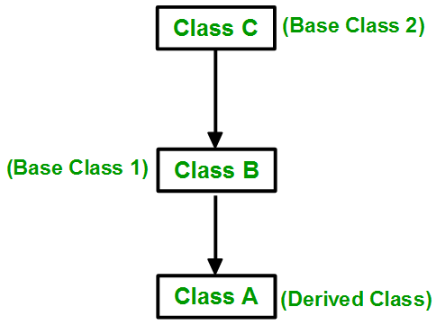

# OOPS

**Class**

-   user defined data-type, which holds its own data members and member functions, which can be accessed and used by creating an instance(Object) of that class.
-   Syntax

    -   Using Different Files

        -   Execute main.cpp file and definition file together, Eg: `g++ -o output main.cpp Polygon.cpp`
        -   Declaration:

            -   The _declaration_ gives the class name, any classes it may extend, declares the members and methods, and declares which members/methods are public, private, or protected.
            -   ```c++
                  // File: polygon.h
                  class Polygon {
                  // Private members and methods are only accessible via methods in the class definition. Default value of access modifier is private.
                  private:
                      int num_sides; // Number of sides
                  // Protected members and methods are only accessible in the class definition or by classes who extend this class
                  protected:
                      std::string name; // Name of the polygon
                  // Public members and methods are accessible to anyone who creates an instance of the class
                  public:
                  // Constructors
                  Polygon(); //default constructor
                  Polygon(const int num_sides, const std::string &name); //Parameterised constructor
                  Polygon(Polygon & p); //copy Constructor: if not defined default copy constructor will be called which performs shallow copying, we should define copy constructor such that it performs deep copying
                  void print();
                  // Destructor
                  ~Polygon(){} // it is called when an object is deleted or released from memory
                  }; // Don't forget the semicolon!
                ```

        -   Definition:
            -   The _definition_ extends the declaration by providing an actual implementation of whatever it is that you're building.
            -   ```c++
                  // File: polygon.cpp
                  #include "polygon.h" // <--- Obtains the class declaration
                  // You must scope the method definitions with the class name (Polygon::)
                  // Constructor
                  Polygon::Polygon(const int num_sides, const std::string &name):num_sides(num_sides)// member initializer list can be used like this to define members of the class
                  {
                      // 'this' is a pointer to the instance of the class. Members are like "this->" or "(*this).".
                      this->name = name;
                  }
                  void Polygon::print() {
                      std::cout << this->name << " " << this->num_sides << std::endl;
                  }
                ```
        -   Class utilization:
            -   ```c++
                  // File: main.cpp
                  #include "Polygon.h" // <--- Obtains the class declaration
                  int main(int argc, char *argv[])
                  {
                      // Create a polygon with 4 sides and the name "Rectangle"
                      Polygon polygon = Polygon(4, "Rectangle");
                      polygon.print();
                      }
                ```

    -   Defining and object creation in a single file
        -   ```c++
              class Geeks {
              public:
                  string geekname;
                  void printname() { cout << "Geekname is:" << geekname; }
              };
              int main()
              {
                  Geeks obj1;
                  obj1.geekname = "Abhi";
                  obj1.printname();
                  return 0;
              }
            ```

-   Encapsulation:
    -   Encapsulation is defined as binding together the data and the functions that manipulate them.
    -   if all the data members are private then it's fully encapsulated
-   Inheritence

    -   The capability of a class to derive properties and characteristics from another class is called Inheritance.
    -   Sub Class: The class that inherits properties from another class is called Subclass or Derived Class.
    -   Super Class: The class whose properties are inherited by a subclass is called Base Class or Superclass.
    -   Derived class syntax
        -   ```c++
              class  <derived_class_name> : <access-specifier> <base_class_name>
              {
                      //body
              }
            ```
    -   
    -   if there is inheritence ambiguity or confusion then scope resolution operator can be used to resolve it
    -   Types:
        -   **Single Inheritence**: 
        -   **Multilevel Inheritence**: 
        -   **Multiple Inheritence**: 
        -   **Hierarchial Inheritence**: 
        -   **Hybrid Inheritence**: 

-   Polymorphism

    -   Polymorphism Types:

        -   Compile Time

            -   Function Overloading

                -   When there are multiple functions with the same name but different parameters, Eg:-
                -   ```c++
                      // Function Overloading
                      function add(int a, int b):
                          return a + b

                      function add(float a, float b):
                          return a + b

                      function add(string a, string b):
                          return a + b
                    ```

            -   Operator Overloading

                -   ```c++
                      // Operator Overloading
                      class Complex{
                          float real
                          float imag

                          // Overloading the + operator for Complex numbers
                          function operator+(Complex other){
                              Complex result
                              result.real = real + other.real
                              result.imag = imag + other.imag
                              return result
                              }
                      };
                    ```

        -   Run Time

            -   Function Overriding:

                -   derived class has a definition for one of the member functions of the base class.
                -   ```c++
                      // Function Overriding
                      class Animal{
                          function makeSound(){
                              print("Animal makes a sound")}

                      class Dog extends Animal{
                          function makeSound():
                              print("Dog barks")}

                      class Cat extends Animal{
                          function makeSound():
                              print("Cat meows")}
                      };
                    ```

            -   Virtual Functions:

                -   A virtual function is a member function that is declared in the base class using the keyword virtual and is re-defined (Overridden) in the derived class.
                -   ```c++
                      // Base class with a virtual function
                      class Animal:
                          virtual function makeSound():
                              print("Animal makes a sound")

                      // Derived classes overriding the virtual function
                      class Dog extends Animal:
                          function makeSound():
                              print("Dog barks")

                      // Function to demonstrate polymorphism
                      function animalSounds(Animal* animal):
                          animal->makeSound()

                      // Example usage
                      Animal* dog = new Dog()

                      animalSounds(dog) // Outputs: Dog barks

                      // Clean up dynamically allocated memory
                      delete dog
                    ```

-   Abstraction
    -   providing only essential information about the data to the outside world, hiding the background details or implementation.

**Templates**

```c++
// Template function to find the maximum of two values
template <typename T>
T maximum(T a, T b) {
    return (a > b) ? a : b;
}
// Template class representing a generic container
template <typename T>
class Container{
    private:
        T item;
    public:
    Container(T val) : item(val) {}
    void printItem() {
        cout << "Item: " << item << endl;}
};
int main() {
    // Using the template function
    int max_int = maximum<int>(5, 10);
    double max_double = maximum<double>(3.14, 2.71);
    cout << "Max integer: " << max_int << endl;
    cout << "Max double: " << max_double << endl;

    // Using the template class
    Container<int> intContainer(42);
    intContainer.printItem();
    Container<string> stringContainer("Hello");
    stringContainer.printItem();
    return 0;
}
```

**Const**

-   The `const` keyword is used to declare constants, define read-only variables, and specify that a member function does not modify the object's state
-   Const Types
    -   Constant Variables
        -   You can declare variables as constants using `const` keyword. Once initialized, the value of these variables cannot be changed. `const int MAX_SIZE = 100;`
    -   Constant Pointer
        -   You can declare a constant pointer or a pointer that points to a constant value or both.
        -   ```cpp
              // Declaration of constant pointer
              const int* ptr1; // Pointer to constant integer
              int* const ptr2; // Constant pointer to integer
              const int* const ptr3; // Constant pointer to constant integer
            ```
    -   Const Member Functions
        -   In classes, you can specify that a member function does not modify the state of the object by appending `const` after the function declaration.
        -   ```cpp
              // Constant member function in a class
              class MyClass {
              public:
                  void print() const {
                      // This function is not allowed to modify member variables of the class
                  }
              };
            ```
    -   Const References
        -   You can declare references as constant, meaning the referenced value cannot be modified through that reference. `const int& ref = 42;`
